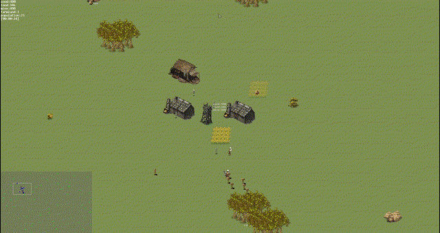
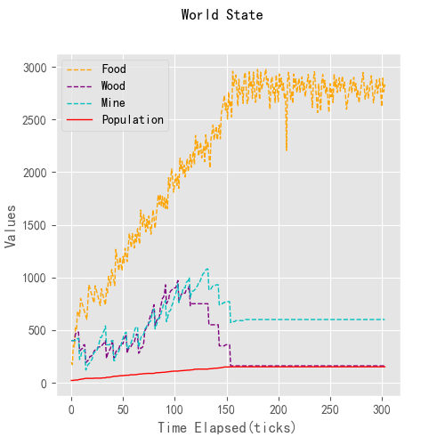

## Agent Village

### 1. Introduction

该 Demo 在整个地图上建立一个村落，村落中所有村民均设定为 Agent，通过为每一个村民 Agent 赋予相应的职责，使得不同职责的村民之间相互协作共同建设和保护村庄。村民共分为五种职业：伐木工、采矿工、建造师、种植工、卫兵。伐木工负责在地图中探寻可用木材资源并砍伐木材回村庄；采矿工负责在地图中探寻矿产资源并采集回村庄；建造师负责利用木材和矿石修筑房屋，房屋数目越多，村落的人口上限越多；种植工负责在村落内种植农作物以获得食物，村落中的每个村民都会不断消耗村落食物，种植工需要通过不断种植农作物以保证村落食物充足；卫兵负责保卫村落不受袭击，在世界地图中会随机刷出野狼，这些野狼会有概率攻击村庄，卫兵需要在有野狼入侵到村落内时及时捕杀野狼。整个地图中木材资源与矿产资源被设定为不可再生资源，目的在于试探这些 Agent 能否在村庄周边资源开采枯竭后尝试去到距离村庄很远的地方进行资源探索。下面是 Agent World 的运行时演示效果：

1. 环境初始时，村落只有少量村民和少量的建筑物，伐木工正在附近的森林进行木材采集：

<div align=center></div>

2. 一段时间后，村落发育逐渐变好，人口也逐渐增多，下图为矿工在村落附近采矿时的画面：

<div align=center></div>

### 2. Resource Monitor

为了更好的观测到整个世界的发展状态，该 Demo 中加入了资源监测的功能，监测包括：木材储存量、矿石储存量、食物储存量和人口数在内的世界状态，可以通过状态资源监控直观的看到村庄随着时间不断发展的情况：

<div align=center></div>

<div align=center></div>

从上图中小地图（左下角）可以发现，经过一段时间后，村民的活动范围变得比之前更大，这是因为场景中设定，村落的规模和人口数成正比，当人口数增加时，村落面积就会向外不断拓展。在实验进行到一段时间后，资源检测器的显示情况如下：

<div align=center></div>

图中黄色线条为食物数量，红色线条为人口数量，蓝色和紫色线条分别代表矿石和木材，可以看到食物曲线和人口数量曲线的增长是保持一致的，在第150个时间片后，人口数量不再增长，而是呈平滑直线向右延申，说明此时人口数量与食物数量达到了平衡，黄色曲线在一个区间内波动（这是因为食物的消耗是持续的，但增加时瞬时的——农作物是在某一时刻全部成熟的），这个区间就是食物量和人口量达到平衡的供求平衡区间。木材和矿产的收敛是因为地图中已经没有可开采的木材和矿石，因此在消耗一段时间后，剩下的数量不足以建造新的房屋，因此数量保持不变。

### 3. Usage

* **clone 该仓库并安装依赖包**

```bash
git clone https://github.com/HarderThenHarder/AgentVillage.git
cd ./AgentVillage
pip install -r requirements.txt
```

* **运行主程序**

```python
main Main.py
```

### 4. Project

这里对项目中较为重要的几个文件进行介绍，方便理解代码结构。

1. **GameEntity**

GameEntity 是场景中所有对象的基类，场景中任何一个对象在定义时都需要继承自该类：

<div align=center></div>

2. **Agent Entity**

该 Demo 中所有的 Agent 实体均存放在 Entity 目录下，一个 Agent 需要包含两个文件：Agent 实体定义 + Agent 状态器。在该 Demo 中，Agent的行为是基于状态机进行行为决策的，因此需要为每一个 Agent 实体定义其对应状态机的状态。

3. **Area config**

AreaConfig 文件定义了全局地图信息，包括木材、矿产的资源数目以及资源的初始位置。

4. **State Machine**

负责行为决策的状态机，每一个实体通过定义属于自身的状态交付给状态机进行行为选择。